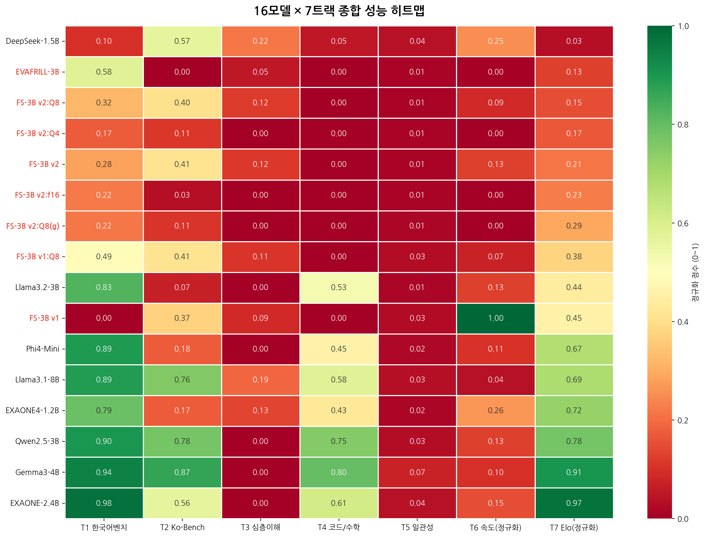
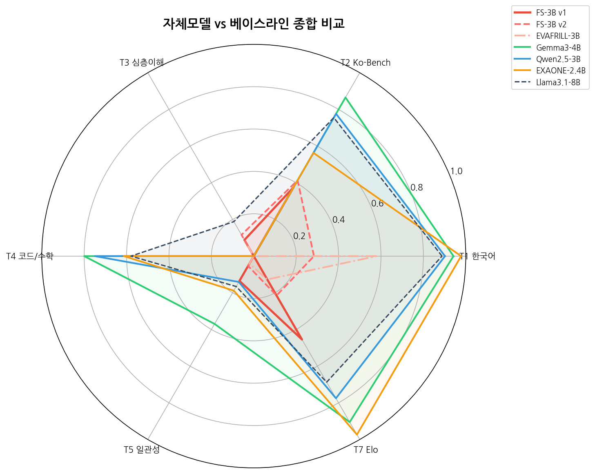
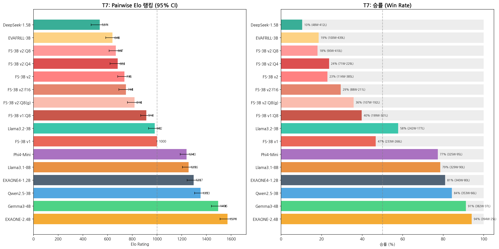

# KoBench Suite (ko-llm-bench-suite)

[한국어](README.md)

A Comprehensive Benchmark Tool for Korean LLM Evaluation

[](LICENSE)
[](https://www.python.org)
[](tests/)

---

## Introduction

KoBench Suite is a comprehensive benchmark framework for evaluating Large Language Models (LLMs) across 7 tracks specifically designed for the Korean language. With a single YAML configuration file, you can add new models and run full evaluations without modifying any code.

### Why Korean LLM Evaluation Needs Specialized Tools

Standard English-centric benchmarks (MMLU, HumanEval, HellaSwag, etc.) fail to capture the unique challenges of the Korean language:

- **Agglutinative morphology**: Korean words are built by chaining morphemes (e.g., a single verb can carry subject, tense, politeness, and mood), making tokenization quality critical to model performance.
- **Honorific system (경어법)**: Korean has seven speech levels and a complex system of subject/object honorifics. A model that generates grammatically correct but socially inappropriate speech is unusable in real Korean applications.
- **SOV word order**: Korean follows Subject-Object-Verb order (unlike English SVO), fundamentally changing how context and reasoning flow in long-form generation.
- **Omission of subjects/objects**: In natural Korean, subjects and objects are routinely dropped when they can be inferred from context. Models must track these implicit references across multi-turn dialogue.
- **Cultural knowledge**: Proverbs (속담), four-character idioms (사자성어), historical references, and social norms are deeply embedded in everyday Korean and require specific training data to handle correctly.
- **Mixed-script challenges**: Korean text frequently mixes Hangul, English loanwords, Chinese characters (한자), and numerical expressions within a single sentence.

KoBench Suite addresses these gaps with dedicated tracks for Korean NLU, deep Korean understanding (honorifics, idioms, cultural knowledge), generation quality in Korean, and cross-track consistency analysis.

## Key Features

- **7 Evaluation Tracks**: Korean Bench (KoBEST), Ko-Bench, Korean Deep Understanding, Code/Math, Consistency, Performance, Pairwise Elo
- **Multiple Inference Backends**: Ollama (local/remote), vLLM (planned)
- **Dual Judge System**: Two LLM judges with weighted cross-validation for more reliable scoring
- **YAML-Based Configuration**: Add models, select tracks, tune sampling parameters -- all without touching code
- **Auto-Generated Reports**: HTML and Markdown reports with 26 visualization charts
- **Checkpoint & Resume**: Long-running evaluations can be interrupted and resumed seamlessly
- **EVAFRILL Support**: Direct PyTorch inference for Mamba-2 hybrid architecture models via built-in HTTP server

## Evaluation Results Preview

Below are selected visualizations from a 13-model evaluation (5 custom Frankenstallm variants + 8 baselines) run on an NVIDIA RTX 5060 Ti 16GB.

### Overall Heatmap (T1-T6 Scores)



A normalized heatmap showing each model's score across Tracks 1 through 6. Darker cells indicate higher scores. Gemma3-4B leads overall, while Frankenstallm shows catastrophic forgetting in T4 (Code/Math) due to ORPO fine-tuning.

### Radar Comparison (Multi-Track Profile)



Radar charts comparing the multi-dimensional profiles of top models. This view highlights each model's strengths and weaknesses across all evaluation dimensions at a glance.

### T7 Pairwise Elo Ranking



Bradley-Terry Elo ratings derived from 3,420+ pairwise comparisons using a dual-judge system. The Elo rankings show strong correlation with composite scores (r=0.90), validating the benchmark's internal consistency.

## Quick Start

### Installation

```bash
# Clone the repository
git clone https://github.com/pathcosmos/ko-llm-bench-suite.git
cd ko-llm-bench-suite

# Install Python dependencies
pip install -r requirements.txt

# Install dev/test dependencies (optional)
pip install -r requirements-dev.txt

# Automated setup (Ollama + Judge models included)
bash setup.sh

# Install Ollama (skip if already installed)
curl -fsSL https://ollama.com/install.sh | sh

# Download judge models
ollama pull qwen2.5:7b-instruct
ollama pull exaone3.5:7.8b

# Download target models (examples)
ollama pull qwen2.5:3b
ollama pull gemma3:4b
```

### Running Evaluations

```bash
# Run with a configuration file
python kobench.py --config configs/examples/frankenstallm.yaml

# Run specific tracks only
python kobench.py --config configs/examples/frankenstallm.yaml --tracks 1 4 6

# Generate report from existing results (no re-evaluation)
python kobench.py --config configs/examples/frankenstallm.yaml --report-only
```

### Configuration Example

```yaml
project:
  name: "My Evaluation"
  output_dir: "./results"
  reports_dir: "./reports"

backend:
  type: ollama
  url: "http://localhost:11434"

models:
  - name: "qwen2.5:3b"
    tags: [baseline]
  - name: "gemma3:4b"
    tags: [baseline]

tracks:
  enabled: [1, 2, 3, 4, 5, 6, 7]

judge:
  dual_enabled: true
  primary:
    model: "qwen2.5:7b-instruct"
    weight: 0.6
  secondary:
    model: "exaone3.5:7.8b"
    weight: 0.4
```

See [`configs/default.yaml`](configs/default.yaml) for the full list of configuration options.

## Evaluation Tracks

### T1: Korean Bench

Evaluates core Korean NLU ability using the KoBEST benchmark suite:

| Task | Description | Metric |
|------|-------------|--------|
| BoolQ | Boolean question answering | Accuracy |
| COPA | Causal reasoning (cause/effect selection) | Accuracy |
| SentiNeg | Sentiment analysis with negation | Accuracy |
| HellaSwag | Sentence completion (common sense) | Accuracy |

Additionally includes a subset of KMMLU (Korean MMLU) for broad knowledge assessment. All tasks are evaluated via exact-match or multiple-choice accuracy -- no LLM judge required.

### T2: Ko-Bench

Evaluates Korean generation quality across 8 categories, each scored by the dual LLM judge system:

| Category | Example Task |
|----------|-------------|
| Writing | Essay composition, creative writing |
| Roleplay | Character-consistent dialogue |
| Reasoning | Logical deduction, argument analysis |
| Math | Word problems, mathematical reasoning |
| Coding | Code generation with Korean specifications |
| Extraction | Information extraction from Korean text |
| STEM | Science/technology explanation in Korean |
| Humanities | History, philosophy, social commentary |

Each response is scored 1-10 by two judges. Multi-turn evaluation (up to 3 turns) measures how well models sustain quality over a conversation.

### T3: Korean Deep Understanding

Tests deep Korean linguistic and cultural knowledge that generic benchmarks miss entirely:

- **Honorific system (존댓말/반말)**: Correct speech level selection based on social context
- **Proverbs and idioms (속담/사자성어)**: Understanding and appropriate use of traditional expressions
- **Cultural knowledge**: Korean history, social norms, holidays, and customs
- **Grammar**: Particle usage, verb conjugation, spacing rules (띄어쓰기)
- **Nuance**: Connotation, implied meaning, indirect expression

Scored by the dual judge system with category-specific rubrics.

### T4: Code & Math

A language-agnostic reasoning track with 70 problems:

| Type | Count | Evaluation |
|------|-------|------------|
| Python coding | 20 | Execution-based (pass/fail) |
| SQL queries | 10 | Output comparison |
| Debug tasks | 10 | Execution-based (pass/fail) |
| Math problems | 30 | Exact answer match |

No LLM judge -- all problems are evaluated programmatically against expected outputs.

### T5: Consistency

Measures response stability across 6 dimensions by asking equivalent questions in different forms:

| Dimension | What It Measures |
|-----------|-----------------|
| Repetition | Same question asked multiple times |
| Paraphrase | Semantically identical but rephrased questions |
| Length sensitivity | Response quality vs. prompt length variation |
| Language mixing | Handling of Korean/English code-switching |
| Instruction following | Adherence to format/constraint instructions |
| Hallucination | Factual consistency across repeated queries |

Scores are computed as similarity/stability coefficients (0-100).

### T6: Performance

Measures raw inference performance metrics:

| Metric | Description |
|--------|-------------|
| Prefill speed | Tokens per second during prompt processing |
| Decode speed | Tokens per second during generation |
| TTFT | Time to first token (latency) |
| VRAM usage | GPU memory consumption |
| Concurrency | Throughput under parallel requests |
| Max context | Longest context the model can handle |

Results are hardware-dependent. The reference evaluation was performed on an NVIDIA RTX 5060 Ti 16GB.

### T7: Pairwise Elo

Every pair of models is compared head-to-head on a shared set of Korean prompts. Two LLM judges independently decide which response is better, and a Bradley-Terry model converts win/loss records into Elo ratings.

- **3,420+ total comparisons** for 13 models
- **Dual judge** with weighted aggregation reduces single-judge bias
- **Bootstrap confidence intervals** for statistical reliability
- **T1-T7 correlation**: r=0.90 -- Elo rankings strongly agree with objective track scores

## System Requirements

| Component | Minimum | Recommended |
|-----------|---------|-------------|
| OS | Ubuntu 22.04+ | Ubuntu 24.04 |
| Python | 3.10+ | 3.12 |
| RAM | 16GB | 32GB |
| GPU | None (CPU possible) | NVIDIA 16GB+ VRAM |
| Disk | 20GB free | 50GB free |

## Project Structure

```
ko-llm-bench-suite/
├── kobench.py                 # Main entry point
├── kobench/                   # Core evaluation framework package
│   ├── __init__.py
│   ├── config.py              # Configuration management
│   ├── runner.py              # Ollama API execution engine
│   ├── judge.py               # Dual LLM-as-Judge system
│   ├── evafrill_runner.py     # EVAFRILL PyTorch direct inference
│   ├── evafrill_server.py     # EVAFRILL HTTP inference server
│   ├── scoring.py             # Scorecard + Bradley-Terry Elo
│   ├── report.py              # HTML/Markdown report generation
│   ├── backends/              # Inference backend abstraction
│   │   ├── base.py            #   InferenceBackend ABC
│   │   └── ollama.py          #   OllamaBackend implementation
│   └── tracks/                # 7 evaluation tracks
│       ├── korean_bench.py    #   T1: KoBEST
│       ├── ko_bench.py        #   T2: Ko-Bench
│       ├── korean_deep.py     #   T3: Deep Understanding
│       ├── code_math.py       #   T4: Code/Math
│       ├── consistency.py     #   T5: Consistency
│       ├── performance.py     #   T6: Performance
│       └── pairwise.py        #   T7: Pairwise Elo
├── configs/                   # YAML configuration files
│   ├── default.yaml           #   Default config (template)
│   └── examples/
│       └── frankenstallm.yaml #   13-model evaluation example
├── benchmarks/                # Benchmark datasets
│   ├── ko_bench/              #   T2 question data
│   ├── korean_deep/           #   T3 question data
│   ├── code_problems/         #   T4 coding problems
│   ├── math_problems/         #   T4 math problems
│   └── track7_prompts.json    #   T7 pairwise prompts
├── examples/
│   └── frankenstallm/         # Frankenstallm evaluation archive
├── tests/                     # pytest tests (515 total)
│   ├── unit/
│   └── integration/
├── results/                   # Evaluation output
├── reports/                   # Generated reports
├── pyproject.toml
├── requirements.txt
└── requirements-dev.txt
```

## Remote Ollama Server

To use Ollama running on a remote GPU server, specify the URL and set `remote: true` in your configuration:

```yaml
backend:
  type: ollama
  url: "http://192.168.1.100:11434"
  remote: true
```

When `remote: true` is set, the framework:
- Sends HTTP `DELETE` requests to unload models after evaluation (freeing VRAM on the remote server)
- Adjusts timeout values for network latency
- Handles connection retry logic for unstable network conditions

## Testing

```bash
# Run all tests (no Ollama or GPU required -- fully mocked)
pytest tests/ -v

# Unit tests only
pytest tests/unit/ -v

# Integration tests only
pytest tests/integration/ -v
```

All 515 tests pass without any external dependencies. The test suite covers:
- Track evaluation logic (all 7 tracks)
- Dual judge scoring and aggregation
- Configuration parsing and validation
- Report generation (HTML + Markdown)
- Checkpoint save/restore
- EVAFRILL HTTP server mode
- Remote Ollama backend

## Example: Frankenstallm Evaluation

The `examples/frankenstallm/` directory contains complete evaluation results for 13 models (5 custom Frankenstallm variants + 8 baselines) across all 7 tracks, run on an NVIDIA RTX 5060 Ti 16GB. HTML/Markdown reports and raw JSON data are all included.

### Top 5 Models (Composite Score)

| Rank | Model | Params | Composite Score | Elo Rating |
|------|-------|--------|:-:|:-:|
| 1 | Gemma3-4B | 4B | 69.8 | 1st |
| 2 | Llama3.1-8B | 8B | 63.4 | 2nd |
| 3 | EXAONE3.5-2.4B | 2.4B | 61.3 | 3rd |
| 4 | Qwen2.5-3B | 3B | 61.1 | 4th |
| 5 | EXAONE4-1.2B | 1.2B | 45.9 | 5th |

### Key Findings

1. **Gemma3-4B dominates**: Highest composite score (69.8) and Elo rank across all 13 models, excelling in both Korean understanding and generation quality.

2. **EXAONE4-1.2B efficiency leader**: Despite being the smallest model at 1.2B parameters, it achieves 1,621 Elo/GB -- the highest efficiency ratio by a wide margin. LG AI Research's Korean-specialized training pays off at small scale.

3. **T1 and T7 strongly correlated (r=0.90)**: The objective KoBEST accuracy scores (T1) align closely with subjective pairwise Elo rankings (T7), validating that both measurement approaches capture genuine model quality.

4. **ORPO causes catastrophic forgetting in T4**: All Frankenstallm variants fine-tuned with ORPO score 0% on Code/Math (T4), despite their base model (EXAONE3.5-2.4B) scoring well. This demonstrates that preference-alignment fine-tuning can completely destroy code/math reasoning capabilities.

5. **v1 > v2 paradox**: Frankenstallm v1 (an earlier, simpler fine-tune) consistently outperforms v2 (which used more data and training steps) across most tracks. More training is not always better -- especially with small models and ORPO, where overfitting and catastrophic forgetting compound.

6. **Korean-specialized models punch above their weight**: EXAONE models (from LG AI Research) consistently outperform larger general-purpose models on Korean-specific tracks (T2, T3), suggesting that targeted Korean training data is more valuable than raw parameter count.

## Checkpoint & Resume

Long-running evaluations can be interrupted and resumed automatically.

- After each model completes, progress is saved to `results/{track}_checkpoint.json`
- Re-running the same command skips completed models and continues from where it left off
- Prevent checkpoint conflicts during parallel execution:

```bash
# Machine A
EVAL_CHECKPOINT_SUFFIX="_a" python kobench.py --tracks 1 2 3

# Machine B
EVAL_CHECKPOINT_SUFFIX="_b" python kobench.py --tracks 4 5 6 7
```

## Multi-Machine Parallel Execution

Distribute evaluations across multiple GPU servers.

```bash
# Server A (local Ollama)
EVAL_CHECKPOINT_SUFFIX="_server_a" python kobench.py --tracks 1 2 3 --models "qwen2.5:3b" "gemma3:4b"

# Server B (remote Ollama)
OLLAMA_BASE_URL="http://gpu-server:11434" OLLAMA_REMOTE=1 \
EVAL_CHECKPOINT_SUFFIX="_server_b" python kobench.py --tracks 4 5 6 --models "qwen2.5:3b" "gemma3:4b"

# Merge results (regenerate report only)
python kobench.py --report-only
```

### SSH Tunnel for Remote Access

```bash
# Set up SSH tunnel to remote Ollama server
ssh -NL 11434:localhost:11434 user@gpu-server &

# Use remote Ollama through the tunnel
OLLAMA_BASE_URL="http://localhost:11434" OLLAMA_REMOTE=1 \
python kobench.py --config my_config.yaml
```

## Judge Model Requirements

> **Required:** Judge models must be installed in Ollama to run Tracks 2, 3, and 7.
> - Primary: `qwen2.5:7b-instruct` (~4.7GB)
> - Secondary: `exaone3.5:7.8b` (~4.8GB)
> - To run without judge models, use only T1, T4, T5, T6: `--tracks 1 4 5 6`

## Interactive Wizard

Step-by-step guided commands for setup and evaluation.

```bash
# Installation verification + Ollama/Judge auto-setup
python kobench.py setup

# Interactive evaluation (model/track selection → execution → results)
python kobench.py eval

# Generate YAML configuration file
python kobench.py config

# System diagnostics (GPU, Ollama, model status)
python kobench.py status
```

> **Note:** Existing batch mode (`--config`, `--tracks`, `--models`) is fully supported.

### Real-Time Dashboard

Monitor evaluation progress in real time from your browser during a run.

```bash
# Automatically starts with the eval wizard
python kobench.py eval

# Enable dashboard in batch mode
python kobench.py --config my.yaml --dashboard
python kobench.py --config my.yaml --dashboard --dashboard-port 9999
```

Open `http://localhost:8888` in your browser to see:
- Per-track progress (completed / running / pending)
- Current model + item progress
- GPU status (VRAM usage)
- Error log
- Estimated time remaining

## Contributing

Contributions are welcome. To get started:

1. Fork the repository
2. Create a feature branch (`git checkout -b feature/my-feature`)
3. Install dev dependencies (`pip install -r requirements-dev.txt`)
4. Run the test suite (`pytest tests/ -v`) and ensure all 515 tests pass
5. Submit a pull request

Areas where contributions are especially appreciated:
- Additional benchmark datasets for Korean evaluation
- New inference backend integrations (vLLM, TGI, etc.)
- Visualization improvements
- Documentation and translation

## License

[MIT](LICENSE)
