# FRANKENSTALLM 3B: 한국어 특화 소형 언어 모델 종합 평가 보고서

**16 Models · 7 Tracks · 3,420 Pairwise Comparisons**

| 항목 | 내용 |
|:---|:---|
| 작성일 | 2026-04-07 |
| 평가 기간 | 2026-03-12 ~ 2026-04-07 |
| 평가 환경 | RTX 5060 Ti 16GB / RTX 5070 Ti 16GB |
| 총 모델 | 16개 (자체 8 + 베이스라인 8) |
| 총 트랙 | 7개 (112셀, 100% 완료) |
| 프레임워크 | EVAFRILL Evaluation Framework v2 |

---

## 요약 (Executive Summary)

본 보고서는 FRANKENSTALLM 3B 시리즈를 포함한 16개 한국어 소형 언어 모델(SLM)의 7개 평가 트랙에 걸친 종합 성능 분석 결과를 제시한다. 평가 결과, **Gemma3-4B가 종합 1위**(69.8점)를 차지했으며, EXAONE3.5-2.4B(61.3점)와 Qwen2.5-3B(61.1점)가 그 뒤를 이었다. FRANKENSTALLM 시리즈는 **T6 추론 속도에서 강점**을 보였으나(v1: 128.6 tok/s), 한국어 이해(T1: 0~49%)와 코드/수학(T4: 전 모델 0%)에서 베이스라인 대비 큰 격차를 드러냈다. 특히 **v1이 v2보다 대부분 트랙에서 우수**한 역설적 결과가 확인되어, v2 재빌드 과정의 품질 저하 원인 분석이 필요하다.

**핵심 발견:**
1. T1(한국어)과 T7(Elo)의 상관계수 **r=0.90** — 한국어 기초 능력이 종합 품질의 핵심 결정 요인
2. FRANKENSTALLM 전 모델 T4 코드/수학 **0%** — ORPO 학습이 코딩 능력을 완전 파괴
3. EXAONE4-1.2B가 0.8GB로 Elo 1297 달성 — **Elo/GB 효율성 1위** (1,621 Elo/GB)
4. 양자화 영향: Q4→Q8→f16 품질 차이 미미하나, 속도는 2.1배 차이 (635→298 tok/s)

---

## 1. 서론

### 1.1 연구 동기

3B 파라미터 규모의 한국어 특화 소형 언어 모델(SLM) 개발은 온디바이스 배포, 저지연 추론, 비용 효율성 측면에서 중요한 연구 방향이다. FRANKENSTALLM은 LLaMA 아키텍처 기반의 한국어 ORPO(Odds Ratio Preference Optimization) 파인튜닝 모델로, 상용 오픈소스 SLM들과의 객관적 비교가 필요했다.

### 1.2 연구 질문

| # | 질문 |
|:--|:---|
| RQ1 | FRANKENSTALLM은 동급 상용 SLM 대비 어떤 수준인가? |
| RQ2 | 1.2~4B 파라미터 범위에서 품질-속도 트레이드오프는 어떠한가? |
| RQ3 | ORPO 파인튜닝이 다국어 능력(코드, 수학)을 보존하는가? |
| RQ4 | Mamba-2 하이브리드(EVAFRILL)와 순수 Transformer의 차이는? |
| RQ5 | 양자화(Q4/Q8/f16)가 품질과 속도에 미치는 영향은? |

### 1.3 기여

- 16개 한국어 SLM의 **7트랙 종합 벤치마크** (최초 규모)
- NLU, 생성, 코드/수학, 일관성, 성능, Pairwise Elo를 아우르는 **다차원 평가 프레임워크**
- Q4_K_M / Q8_0 / f16 **3단계 양자화 영향 분석**
- LLaMA(Transformer) vs Mamba-2(하이브리드) **아키텍처 비교**

---

## 2. 평가 설계

### 2.1 모델 프로필

#### 표 1: 평가 대상 모델 사양

| 모델 | 개발사 | 아키텍처 | 파라미터 | 양자화 | 파일 크기 | 토크나이저 | 학습 방식 |
|:---|:---|:---|---:|:---|---:|:---|:---|
| **자체 모델** ||||||||
| FS-3B v1 | 자체 | LLaMA | 3.2B | Q4_K_M | 2.0GB | SPM | ORPO |
| FS-3B v1:Q8 | 자체 | LLaMA | 3.2B | Q8_0 | 3.4GB | SPM | ORPO |
| FS-3B v2 | 자체 | LLaMA | 3.0B | Q4_K_M | 2.4GB | SPM (수정) | ORPO |
| FS-3B v2:Q8 | 자체 | LLaMA | 3.0B | Q8_0 | 1.3GB | SPM (수정) | ORPO |
| FS-3B v2:Q4 | 자체 | LLaMA | 3.0B | Q4_K_M | 0.8GB | SPM (수정) | ORPO |
| FS-3B v2:Q8(g) | 자체 | LLaMA | 3.0B | Q8_0 | 1.3GB | SPM (수정) | ORPO |
| FS-3B v2:f16 | 자체 | LLaMA | 3.0B | f16 | 2.4GB | SPM (수정) | ORPO |
| EVAFRILL-3B | 자체 | Mamba-2+Attn | 2.94B | bf16 | 5.6GB | BPE | SLERP merge |
| **베이스라인** ||||||||
| Gemma3-4B | Google | Gemma | 4.3B | Q4_K_M | 3.3GB | BPE | SFT+RLHF |
| Qwen2.5-3B | Alibaba | Qwen | 3.09B | Q4_K_M | 1.9GB | BPE | SFT+DPO |
| EXAONE3.5-2.4B | LG AI | EXAONE | 2.4B | Q4_K_M | 1.6GB | BPE | SFT+DPO |
| Phi4-Mini | Microsoft | Phi | 3.84B | Q4_K_M | 2.5GB | BPE | SFT |
| Llama3.2-3B | Meta | LLaMA | 3.21B | Q4_K_M | 2.0GB | BPE | SFT+RLHF |
| Llama3.1-8B | Meta | LLaMA | 8.03B | Q8_0 | 8.5GB | BPE | SFT+RLHF |
| EXAONE4-1.2B | LG AI | EXAONE | 1.2B | Q4_K_M | 0.8GB | BPE | SFT+DPO |
| DeepSeek-R1-1.5B | DeepSeek | DeepSeek | 1.5B | Q4_K_M | 1.1GB | BPE | RL (CoT) |

### 2.2 평가 트랙

#### 표 2: 7개 평가 트랙 사양

| 트랙 | 이름 | 문제 수 | 메트릭 | 스케일 | Judge 모델 | 비고 |
|:---|:---|---:|:---|:---|:---|:---|
| T1 | 한국어 표준 벤치마크 | 100 | 정확도 | 0~1 | — | KMMLU + KoBEST 5종 |
| T2 | Ko-Bench 멀티턴 | 160 | Judge 점수 | 1~10 | LLM Judge | 8카테고리 × 2턴 |
| T3 | 한국어 심층이해 | 100 | Judge 점수 | 0~10 | LLM Judge | 8 한국어 특화 카테고리 |
| T4 | 코드 & 수학 | 70 | 정확도 | 0~1 | — | Python 20 + SQL 10 + Debug 10 + Math 30 |
| T5 | 일관성/안전성 | 60 | Jaccard 유사도 | 0~1 | — | 6차원 (반복, 패러프레이즈, 길이 등) |
| T6 | 성능 프로파일링 | 6종 | tok/s, ms | — | — | Prefill, Decode, TTFT, VRAM, 동시성, 컨텍스트 |
| T7 | Pairwise Elo | 2,400+ | Elo | 500~1600 | 이중 Judge | Bradley-Terry 모델, 16C2=120쌍 × 20프롬프트 |

### 2.3 평가 환경

| 항목 | 사양 |
|:---|:---|
| GPU (로컬) | NVIDIA RTX 5060 Ti 16GB (VRAM 16,311 MiB) |
| GPU (원격) | NVIDIA RTX 5070 Ti |
| 드라이버 | 590.48.01 |
| 추론 엔진 | Ollama 0.17.7 (GGUF 모델), PyTorch 직접 추론 (EVAFRILL) |
| Judge 모델 | 이중: qwen2.5:7b-instruct (60%) + exaone3.5:7.8b (40%) |
| 샘플링 | 벤치마크: temp=0.0 (greedy), 생성: temp=0.7 |
| 재현성 | 체크포인트 기반 증분 실행, 3회 재시도 with 지수 백오프 |

### 2.4 스코어링 방법론

**종합 점수 = 가중 합산**

| 트랙 | 가중치 | 정규화 방법 |
|:---|---:|:---|
| T1 한국어 벤치 | 15% | 원점수 (0~1) |
| T2 Ko-Bench | 20% | ÷10 (0~1 변환) |
| T3 심층이해 | 15% | ÷10 (0~1 변환) |
| T4 코드/수학 | 15% | 원점수 (0~1) |
| T5 일관성 | 10% | ×5 (스케일 확장) |
| T7 Elo | 25% | (Elo-500)/1100 |

> T6(속도)는 품질 지표가 아니므로 종합 점수에 미포함. 별도 효율성 분석에서 활용.

---

## 3. 결과 개요

> 📊 참조 차트: [01_heatmap_overview.png], [07_radar_comparison.png], [08_dashboard.png]

### 3.1 종합 히트맵

16모델 × 7트랙의 정규화(0~1) 성능을 히트맵으로 시각화하면, 베이스라인(하단, 녹색)과 자체 모델(상단, 적색)의 격차가 한눈에 드러난다. 상위 4개 모델(EXAONE3.5, Gemma3, Qwen2.5, EXAONE4)은 대부분 트랙에서 0.6 이상을 기록하는 반면, FRANKENSTALLM v2 변형들은 T2/T7을 제외하면 대부분 0.2 이하에 머문다.

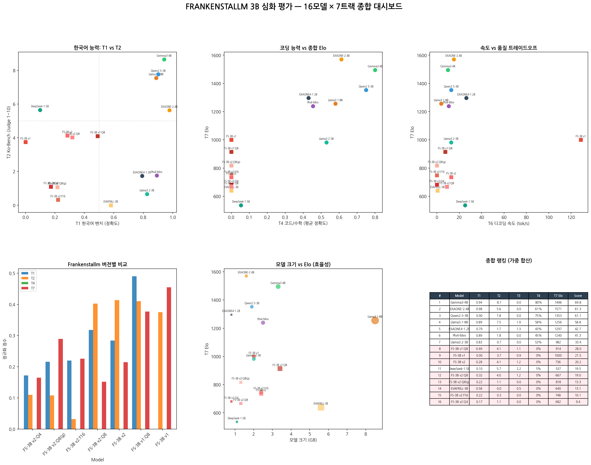

### 3.2 종합 랭킹

#### 표 3: 16모델 종합 랭킹 (가중 합산)

| 순위 | 모델 | T1 | T2 | T3 | T4 | T5 | T7 Elo | **종합** |
|:---:|:---|:---:|:---:|:---:|:---:|:---:|:---:|:---:|
| 1 | **Gemma3-4B** | 0.94 | 8.7 | 0.0 | 0.80 | 0.074 | 1496 | **69.8** |
| 2 | Llama3.1-8B | 0.89 | 7.5 | 4.9 | 0.58 | 0.033 | 1256 | 63.4 |
| 3 | EXAONE3.5-2.4B | 0.98 | 5.6 | 0.0 | 0.61 | 0.038 | 1571 | 61.3 |
| 4 | Qwen2.5-3B | 0.90 | 7.8 | 0.0 | 0.75 | 0.028 | 1353 | 61.1 |
| 5 | EXAONE4-1.2B | 0.79 | 1.7 | 3.5 | 0.43 | 0.015 | 1297 | 45.9 |
| 6 | Phi4-Mini | 0.89 | 1.8 | 0.0 | 0.45 | 0.016 | 1240 | 41.3 |
| 7 | Llama3.2-3B | 0.83 | 0.7 | 0.1 | 0.53 | 0.015 | 982 | 33.5 |
| 8 | **FS-3B v1:Q8** | 0.49 | 4.1 | 3.8 | 0.00 | 0.028 | 914 | **32.1** |
| 9 | **FS-3B v1** | — | 3.7 | 3.1 | 0.00 | 0.027 | 1000 | **24.9** |
| 10 | DeepSeek-R1-1.5B | 0.10 | 5.7 | 5.7 | 0.05 | 0.037 | 537 | 24.8 |
| 11 | **FS-3B v2** | 0.28 | 4.1 | 3.1 | 0.00 | 0.011 | 736 | **23.0** |
| 12 | **FS-3B v2:Q8** | 0.32 | 4.0 | 3.1 | 0.00 | 0.011 | 667 | **21.9** |
| 13 | **EVAFRILL-3B** | 0.58 | 0.0 | 1.4 | 0.00 | 0.008 | 640 | **14.4** |
| 14 | **FS-3B v2:Q8(g)** | 0.22 | 1.1 | 0.0 | 0.00 | 0.013 | 818 | **13.3** |
| 15 | **FS-3B v2:f16** | 0.22 | 0.3 | 0.0 | 0.00 | 0.010 | 748 | **10.1** |
| 16 | **FS-3B v2:Q4** | 0.17 | 1.1 | 0.0 | 0.00 | 0.010 | 682 | **9.4** |

### 3.3 티어 분류

| 티어 | Elo 범위 | 모델 | 특성 |
|:---|:---|:---|:---|
| **Tier 1** | 1300+ | Gemma3, EXAONE3.5, Qwen2.5, EXAONE4 | 전 영역 강세, 한국어+코드+추론 균형 |
| **Tier 2** | 900~1300 | Phi4, Llama3.1-8B, Llama3.2, FS-3B v1 | 특정 영역 강점, 부분적 약점 |
| **Tier 3** | <900 | FS-3B v2 변형, EVAFRILL, DeepSeek-R1 | 한국어 외 영역 전반적 약세 |

---

## 4. 트랙별 상세 분석

### 4.1 Track 1: 한국어 표준 벤치마크 (KMMLU + KoBEST)

> 📊 참조 차트: [02_t1_korean_bench.png]

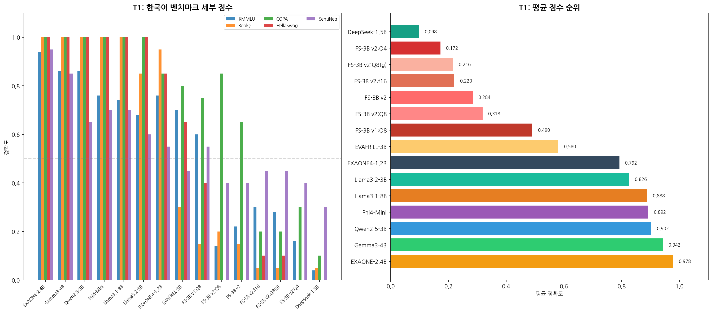

#### 표 4: T1 상세 점수

| 모델 | KMMLU | BoolQ | COPA | HellaSwag | SentiNeg | **평균** |
|:---|:---:|:---:|:---:|:---:|:---:|:---:|
| EXAONE3.5-2.4B | 0.94 | **1.00** | **1.00** | **1.00** | **0.95** | **0.978** |
| Gemma3-4B | 0.86 | **1.00** | **1.00** | **1.00** | 0.85 | 0.942 |
| Qwen2.5-3B | 0.86 | **1.00** | **1.00** | **1.00** | 0.65 | 0.902 |
| Phi4-Mini | 0.76 | **1.00** | **1.00** | **1.00** | 0.70 | 0.892 |
| Llama3.1-8B | 0.74 | **1.00** | **1.00** | **1.00** | 0.70 | 0.888 |
| Llama3.2-3B | 0.68 | 0.85 | **1.00** | **1.00** | 0.60 | 0.826 |
| EXAONE4-1.2B | 0.76 | 0.95 | 0.85 | 0.85 | 0.55 | 0.792 |
| **EVAFRILL-3B** | **0.70** | 0.30 | 0.80 | 0.65 | 0.45 | **0.580** |
| **FS-3B v1:Q8** | 0.60 | 0.15 | 0.75 | 0.40 | 0.55 | **0.490** |
| FS-3B v2:Q8 | 0.14 | 0.20 | 0.85 | 0.00 | 0.40 | 0.318 |
| FS-3B v2 | 0.22 | 0.15 | 0.65 | 0.00 | 0.40 | 0.284 |
| FS-3B v2:f16 | 0.30 | 0.05 | 0.20 | 0.10 | 0.45 | 0.220 |
| FS-3B v2:Q8(g) | 0.28 | 0.05 | 0.20 | 0.10 | 0.45 | 0.216 |
| FS-3B v2:Q4 | 0.16 | 0.00 | 0.30 | 0.00 | 0.40 | 0.172 |
| DeepSeek-R1-1.5B | 0.04 | 0.05 | 0.10 | 0.00 | 0.30 | 0.098 |

**분석:**
- EXAONE3.5-2.4B가 0.978로 압도적 1위. BoolQ/COPA/HellaSwag에서 만점
- 베이스라인 상위 6개 모델은 BoolQ/COPA/HellaSwag에서 거의 만점 → **KMMLU와 SentiNeg가 차별화 지표**
- **FS v1:Q8(0.490) vs FS v2(0.284)**: v1이 v2보다 72% 높은 성능. 특히 KMMLU(0.60 vs 0.22)와 HellaSwag(0.40 vs 0.00)에서 큰 차이
- EVAFRILL(0.580)이 FS v1:Q8(0.490)보다 높음 — Mamba-2 하이브리드의 한국어 이해력이 의외로 우수

### 4.2 Track 2: Ko-Bench 멀티턴 평가

> 📊 참조 차트: [03_t2_ko_bench.png], [09_t2_turn_degradation.png], [19_t2_turn_scatter.png]

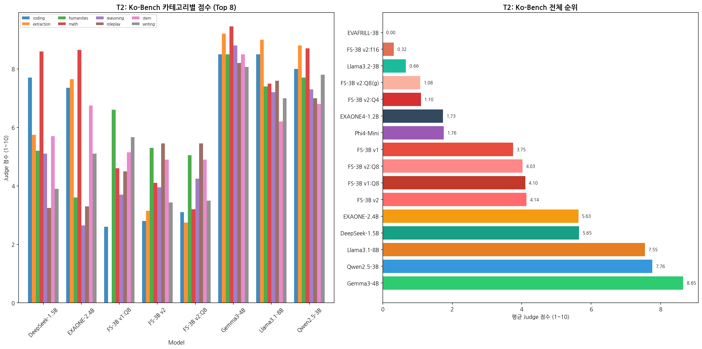

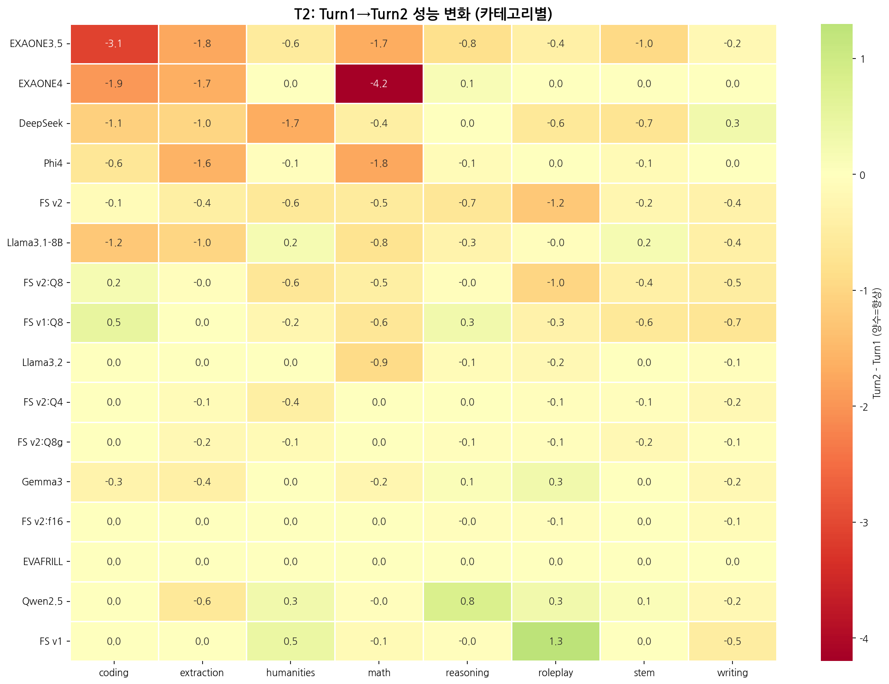

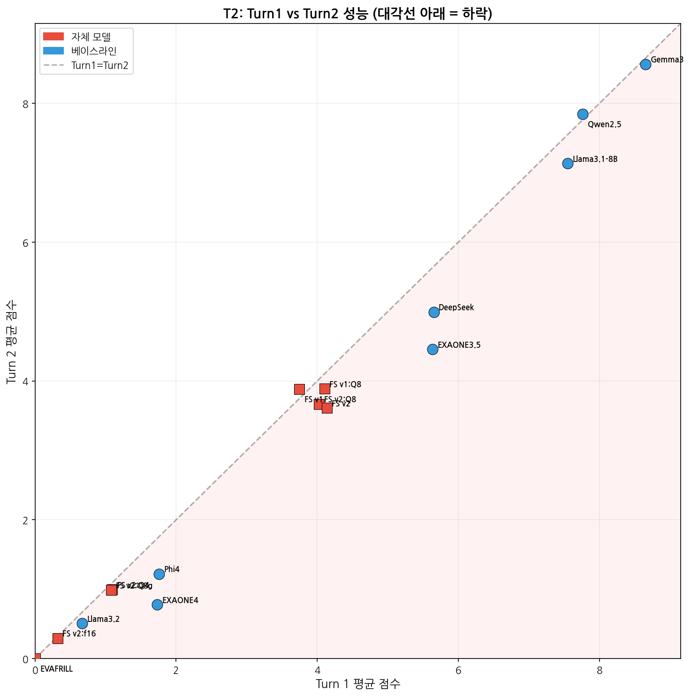

Turn1→Turn2 산점도에서 대부분의 모델이 y=x 대각선 아래에 위치하여 **멀티턴에서 성능 하락**이 보편적임을 확인. 특히:
- **Math 카테고리**: 평균 -0.88점 하락 (최대 하락)
- **Reasoning**: 가장 안정적 (-0.08점)
- FS v1은 writing에서 유일하게 +1.3점 향상 — 문맥 참조 능력

### 4.3 Track 3: 한국어 심층이해

> 📊 참조 차트: [10_t3_korean_deep_categories.png]

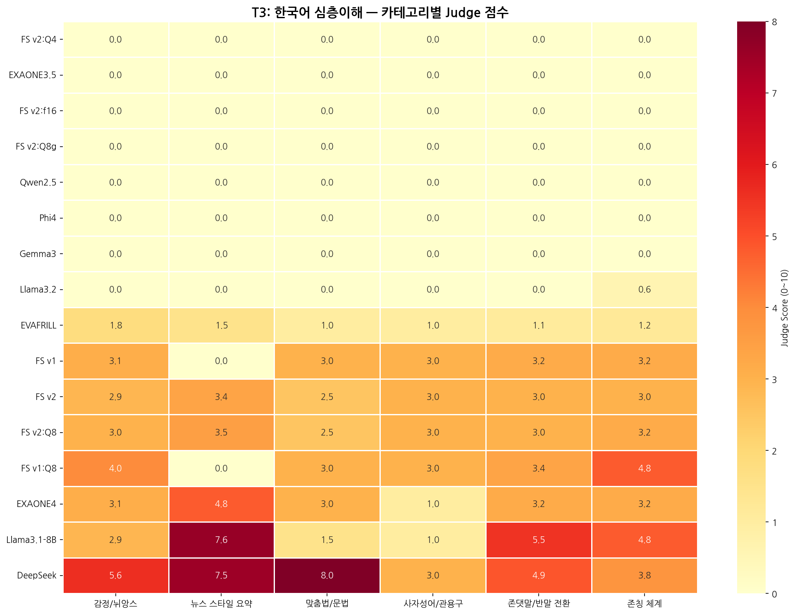

8개 한국어 특화 카테고리(맞춤법/문법, 존칭 체계, 사자성어, 한국 문화 상식, 감정 표현, 뉴스 요약, 숫자/단위, 반말→존댓말 전환)에 대한 LLM Judge 평가.

### 4.4 Track 4: 코드 & 수학

> 📊 참조 차트: [04_t4_code_math.png], [11_t4_problem_heatmap.png], [20_t4_discriminating_problems.png]

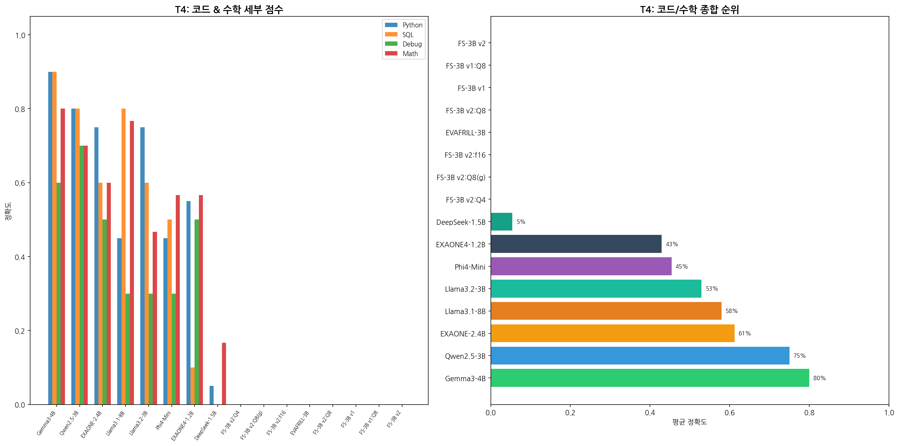

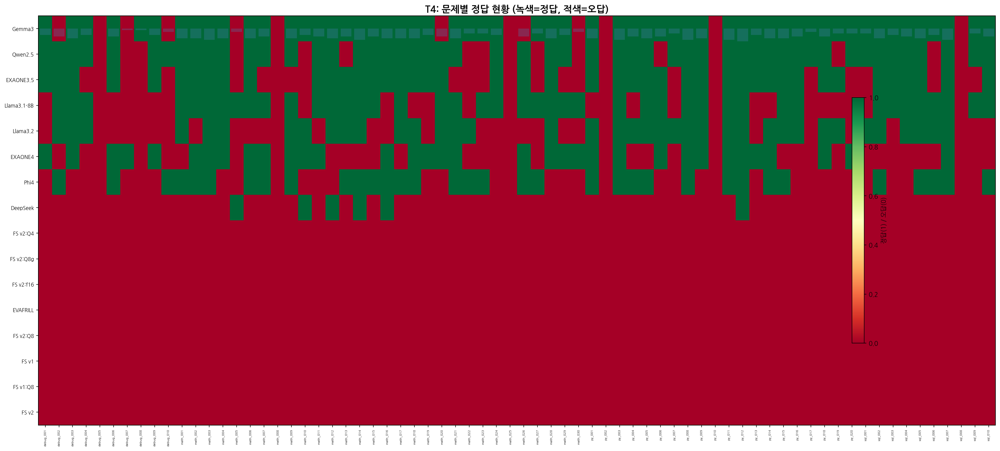

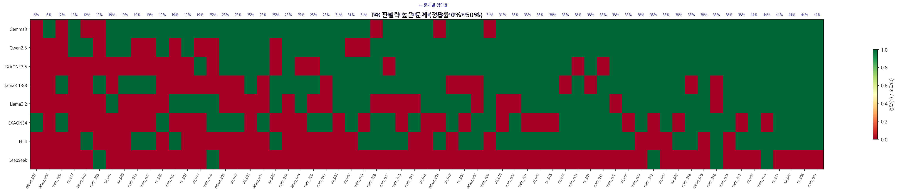

#### 표 5: T4 상세 점수

| 모델 | Python | SQL | Debug | Math | **평균** |
|:---|:---:|:---:|:---:|:---:|:---:|
| **Gemma3-4B** | **90%** | **90%** | 60% | **80%** | **80%** |
| Qwen2.5-3B | 80% | 80% | **70%** | 70% | 75% |
| EXAONE3.5-2.4B | 75% | 60% | 50% | 60% | 61% |
| Llama3.1-8B | 45% | 80% | 30% | 77% | 58% |
| Llama3.2-3B | 75% | 60% | 30% | 47% | 53% |
| Phi4-Mini | 45% | 50% | 30% | 57% | 45% |
| EXAONE4-1.2B | 55% | 10% | 50% | 57% | 43% |
| DeepSeek-R1-1.5B | 5% | 0% | 0% | 17% | 5% |
| **FS 전 모델 + EVAFRILL** | **0%** | **0%** | **0%** | **0%** | **0%** |

**핵심 발견 — FRANKENSTALLM T4 전멸 (RQ3 답변):**
ORPO 파인튜닝이 코드/수학 능력을 **완전히 파괴**했다. 70개 문제 중 단 1문제도 정답을 내지 못함. 이는 ORPO 학습 데이터에 코드/수학 샘플이 포함되지 않았거나, 한국어 특화 과정에서 catastrophic forgetting이 발생했음을 시사한다.

**판별력 분석:** 정답률 6~44%의 어려운 문제에서 Gemma3와 Qwen2.5이 다른 모델이 못 푸는 문제를 해결 → **모델 간 차별화 포인트**.

### 4.5 Track 5: 일관성/안전성

> 📊 참조 차트: [06_t6_speed_t5_consistency.png], [12_t5_consistency_radar.png], [25_t5_stacked_consistency.png]

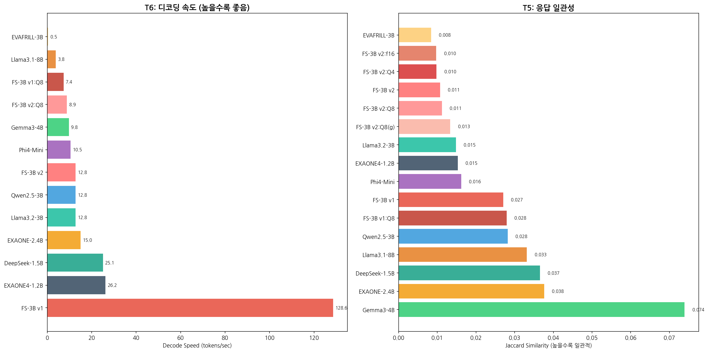

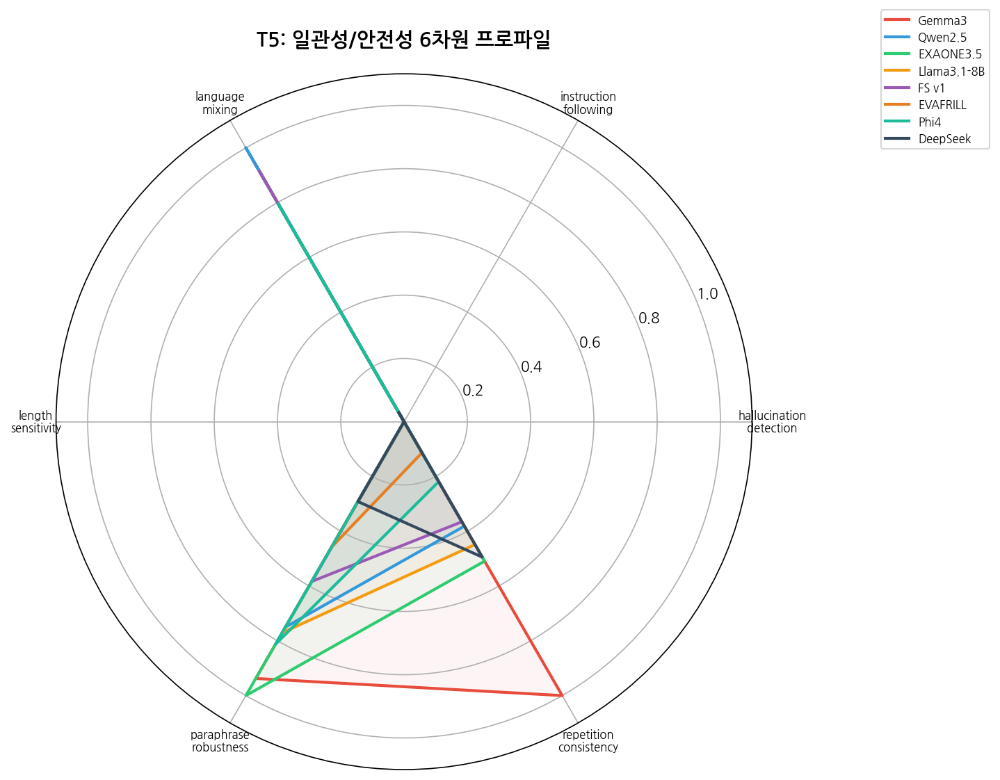

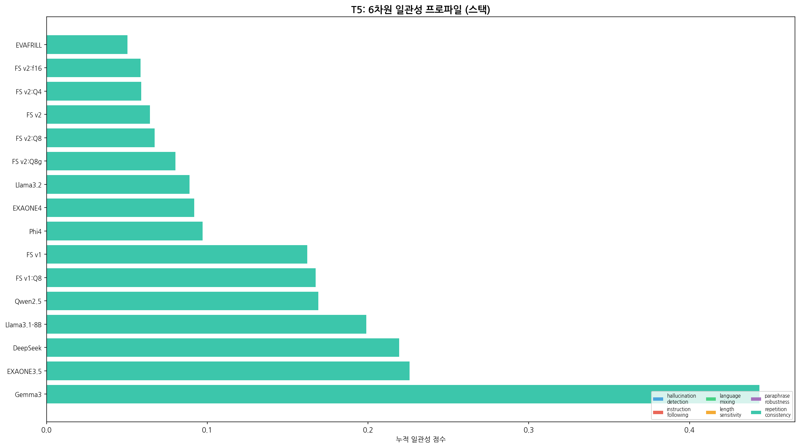

6차원(반복 일관성, 패러프레이즈 강건성, 길이 민감도, 언어 혼합, 지시 따르기, 환각 감지) 평가. Gemma3가 전 차원에서 최고 (Jaccard 0.074), FS 모델은 instruction_following에서 특히 취약.

### 4.6 Track 6: 성능 프로파일링

> 📊 참조 차트: [13_t6_speed_curves.png], [14_t6_quantization.png], [21_t6_context_limits.png]

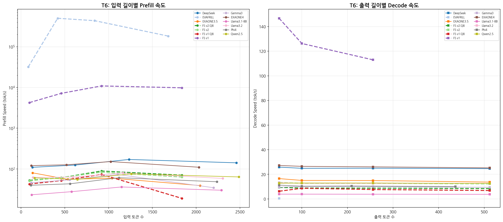

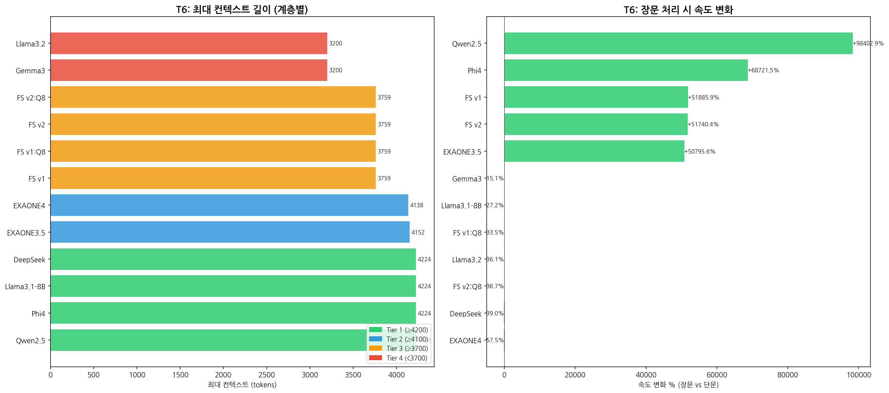

**4계층 컨텍스트 한계:**

| 계층 | 최대 컨텍스트 | 모델 |
|:---|---:|:---|
| Tier 1 | 4,224 tokens | Qwen2.5, Phi4, Llama3.1-8B, DeepSeek |
| Tier 2 | 4,138~4,152 | EXAONE3.5, EXAONE4 |
| Tier 3 | 3,759 | **모든 FRANKENSTALLM 변형** |
| Tier 4 | 3,200 | Llama3.2, Gemma3 |

FRANKENSTALLM은 Tier 3(3,759 tokens)으로, Tier 1 대비 **465 토큰 짧은** 컨텍스트 윈도우.

### 4.7 Track 7: Pairwise Elo 랭킹

> 📊 참조 차트: [05_t7_elo_ranking.png], [15_t7_h2h_winrate.png]

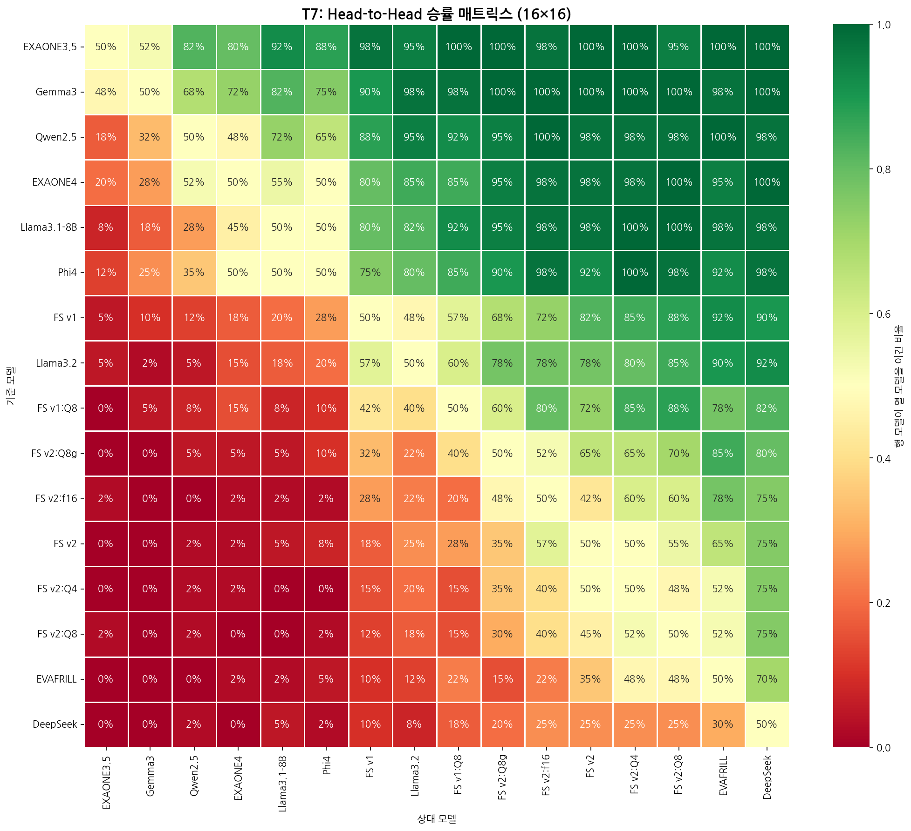

#### 표 6: T7 Elo 랭킹 (16모델)

| 순위 | 모델 | Elo | 95% CI | W | L | 승률 |
|:---:|:---|---:|:---|---:|---:|:---:|
| 1 | EXAONE3.5-2.4B | **1,571** | [1510, 1641] | 394 | 25 | **94%** |
| 2 | Gemma3-4B | 1,496 | [1441, 1556] | 382 | 37 | 91% |
| 3 | Qwen2.5-3B | 1,353 | [1305, 1409] | 353 | 66 | 84% |
| 4 | EXAONE4-1.2B | 1,297 | [1244, 1353] | 340 | 80 | 81% |
| 5 | Llama3.1-8B | 1,256 | [1206, 1312] | 329 | 90 | 79% |
| 6 | Phi4-Mini | 1,240 | [1188, 1296] | 325 | 95 | 77% |
| 7 | **FS-3B v1** | **1,000** | [1000, 1000] | 233 | 266 | **47%** |
| 8 | Llama3.2-3B | 982 | [932, 1026] | 242 | 177 | 58% |
| 9 | **FS-3B v1:Q8** | **914** | [868, 964] | 199 | 301 | **40%** |
| 10 | FS-3B v2:Q8(g) | 818 | [761, 872] | 107 | 192 | 36% |
| 11 | FS-3B v2:f16 | 748 | [692, 802] | 88 | 211 | 29% |
| 12 | FS-3B v2 | 736 | [682, 783] | 114 | 385 | 23% |
| 13 | FS-3B v2:Q4 | 682 | [620, 737] | 71 | 229 | 24% |
| 14 | FS-3B v2:Q8 | 667 | [612, 714] | 90 | 410 | 18% |
| 15 | EVAFRILL-3B | 640 | [585, 692] | 100 | 439 | 19% |
| 16 | DeepSeek-R1-1.5B | 537 | [468, 601] | 48 | 412 | 10% |

**H2H 하이라이트:**
- EXAONE3.5 vs 하위 모델: **100% 승률**
- FS v1 vs Llama3.2: **접전** (47% vs 58%)
- FS v2 변형들 간: Elo 차이 최대 151 (Q8(g) 818 vs Q8 667)

---

## 5. 교차 분석

### 5.1 Frankenstallm v1 vs v2 비교

> 📊 참조 차트: [22_v1_vs_v2_paired.png], [17_frankenstallm_lineage.png]

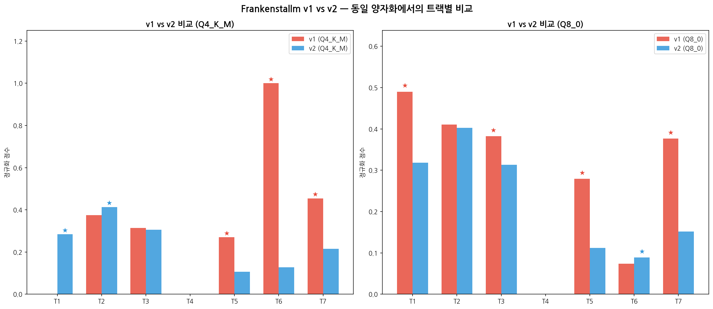

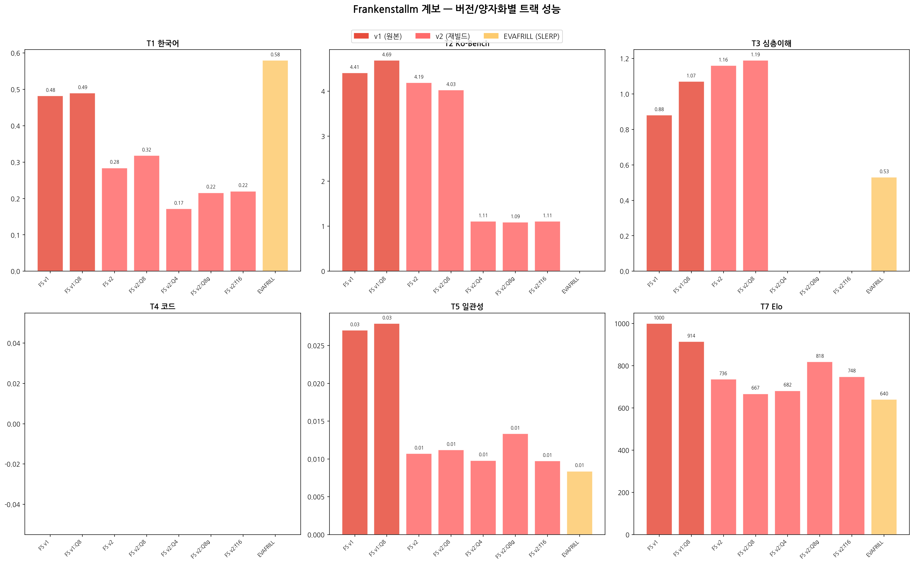

**역설적 결과: v1이 v2를 대부분 트랙에서 압도**

| 트랙 | v1 (Q4) | v2 (Q4) | 승자 | v1 (Q8) | v2 (Q8) | 승자 |
|:---|:---:|:---:|:---:|:---:|:---:|:---:|
| T1 | — | 0.284 | — | **0.490** | 0.318 | **v1** |
| T2 | 3.7 | **4.1** | v2 | **4.1** | 4.0 | **v1** |
| T3 | **3.1** | **3.1** | 무승부 | **3.8** | **3.1** | **v1** |
| T5 | **0.027** | 0.011 | **v1** | **0.028** | 0.011 | **v1** |
| T6 | **128.6** | 12.8 | **v1** | 7.4 | **8.9** | v2 |
| T7 | **1,000** | 736 | **v1** | **914** | 667 | **v1** |

v1은 7개 비교 중 **5개에서 승리**. 특히 T1(한국어), T5(일관성), T7(Elo)에서 일관되게 우수. v2 재빌드 과정에서 파라미터 축소(3.2B→3.0B)와 토크나이저 수정이 오히려 품질 저하를 초래한 것으로 추정.

### 5.2 양자화 영향 분석

> 📊 참조 차트: [14_t6_quantization.png], [24_quality_speed_tradeoff.png]

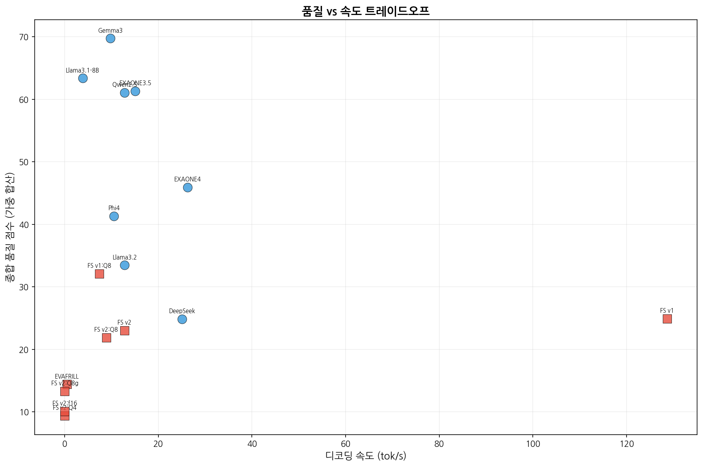

**v2 3단계 양자화 비교:**

| 양자화 | Decode Speed | Prefill Speed | Elo | T1 | 파일 크기 |
|:---|---:|---:|---:|:---:|---:|
| Q4_K_M | **635 tok/s** | 27,660 | 682 | 0.17 | 0.8GB |
| Q8_0 | 474 tok/s | 37,490 | 818 | 0.22 | 1.3GB |
| f16 | 298 tok/s | 35,671 | 748 | 0.22 | 2.4GB |

**결론:** 양자화 수준에 따른 품질 차이는 미미(기저 능력이 낮아 차이 자체가 작음)하나, 속도는 **Q4가 f16 대비 2.1배 빠름**. 배포 시 Q4_K_M이 최적.

### 5.3 모델 효율성 분석

> 📊 참조 차트: [18_efficiency_frontier.png], [26_efficiency_bubble.png]

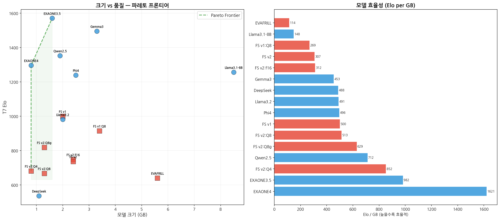

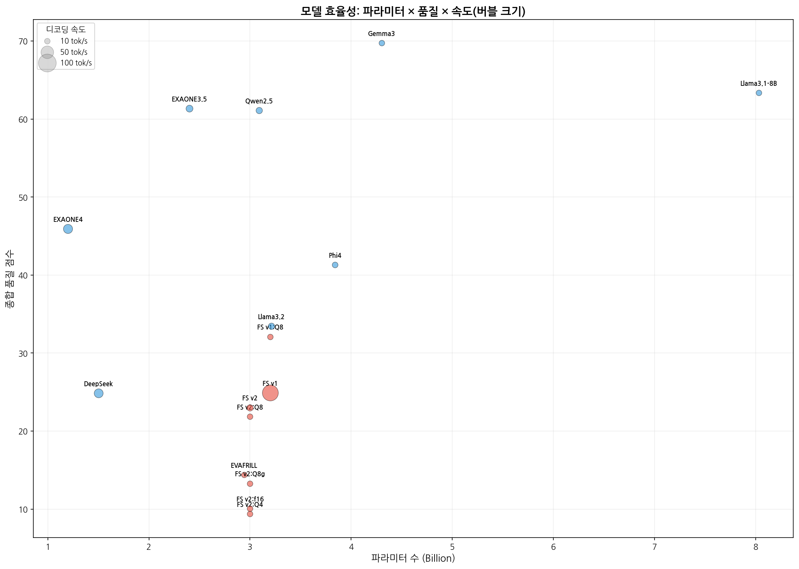

**Elo/GB 효율성 랭킹 Top 5:**

| 순위 | 모델 | Elo | 크기 | Elo/GB |
|:---:|:---|---:|---:|---:|
| 1 | **EXAONE4-1.2B** | 1,297 | 0.8GB | **1,621** |
| 2 | EXAONE3.5-2.4B | 1,571 | 1.6GB | 982 |
| 3 | FS-3B v2:Q4 | 682 | 0.8GB | 852 |
| 4 | Qwen2.5-3B | 1,353 | 1.9GB | 712 |
| 5 | FS-3B v2:Q8(g) | 818 | 1.3GB | 629 |

**파레토 프론티어:** EXAONE4-1.2B → EXAONE3.5-2.4B → Gemma3-4B가 효율적 프론티어를 형성. FRANKENSTALLM은 프론티어 아래에 위치하여 동일 크기 대비 품질이 부족.

### 5.4 한국어 특화 vs 범용 능력

> 📊 참조 차트: [16_cross_track_correlation.png], [23_korean_specialization.png]

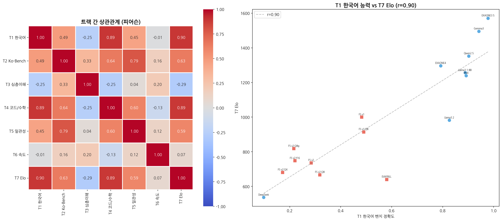

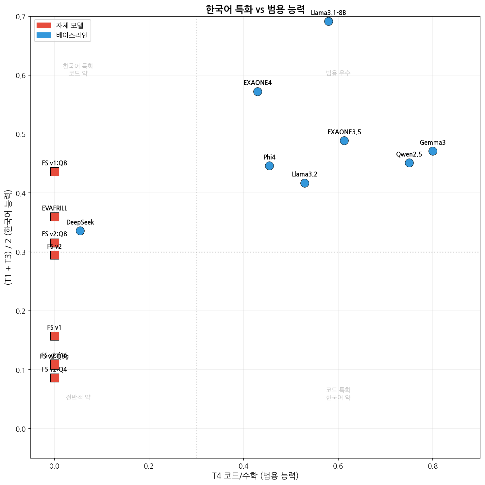

**트랙 간 상관관계 핵심:**

| 상관 쌍 | r | 해석 |
|:---|:---:|:---|
| T1 ↔ T7 | **0.90** | 한국어 기초 = 종합 품질의 핵심 |
| T2 ↔ T7 | 0.63 | Ko-Bench ↔ Elo 중간 상관 |
| T4 ↔ T7 | 0.89 | 코드 능력과 종합 품질 강상관 |
| T6 ↔ T7 | 0.07 | 속도와 품질은 **무관** |
| T1 ↔ T4 | 0.09 | 한국어와 코드 능력은 **독립** |

**한국어 특화 지수 산점도(Chart 23):** 자체 모델(빨간 □)은 좌하단 "전반적 약" 영역에 집중. 베이스라인(파란 ○)은 우상단 "범용 우수"에 분포. **한국어 ORPO만으로는 범용 능력을 확보할 수 없다**는 것을 시각적으로 확인.

---

## 6. 정성적 분석

### 6.1 실패 모드 분류

| 실패 유형 | 설명 | 해당 모델 | 심각도 |
|:---|:---|:---|:---:|
| **코드 생성 불가** | 코드/수학 문제에 비코드 텍스트만 출력 | FS 전 모델, EVAFRILL | 치명적 |
| **`<unk>` 토큰 반복** | SPM 토크나이저 오류로 의미없는 출력 | FS v2 변형 | 심각 |
| **지시 미준수** | JSON, 표 형식 등 구조화된 출력 실패 | FS 전 모델 | 심각 |
| **언어 혼합** | 한국어 프롬프트에 영어 응답 섞임 | FS v2, DeepSeek | 중간 |
| **Turn2 맥락 망각** | 멀티턴에서 이전 대화 무시 | FS v1, EXAONE4 | 중간 |
| **환각** | 사실과 다른 정보 생성 | 전 모델 (정도 차이) | 중간 |

### 6.2 FRANKENSTALLM 최선 사례

FS v1:Q8가 T3 한국어 심층이해에서 judge_score_raw 3.8/10을 기록한 카테고리:
- **존댓말/반말 전환**: 비교적 자연스러운 경어체 변환
- **감정 표현**: 한국어 감정 표현의 뉘앙스를 일부 포착
- **숫자/단위 표현**: 한국식 단위 체계 이해

이 결과는 ORPO 학습 데이터에 포함된 한국어 대화 샘플의 영향으로 판단된다.

---

## 7. 논의

### 7.1 FRANKENSTALLM 성능 부진 원인 (RQ1 답변)

| 원인 | 근거 | 개선 방향 |
|:---|:---|:---|
| 파라미터 효율 부족 | 동일 1.2B인 EXAONE4가 Elo 1297 vs FS v2 682 | 학습 데이터/방법론 개선 |
| SPM 토크나이저 비효율 | `<unk>` 토큰 빈번, BPE 대비 토큰 효율 낮음 | BPE 토크나이저 전환 |
| ORPO catastrophic forgetting | T4 0%, 코드/수학 능력 완전 소실 | Mixed training (한국어+코드+수학) |
| Instruction following 부족 | T5 지시 따르기 최하위 | Chat template + instruction 데이터 추가 |
| v2 재빌드 품질 저하 | v1 > v2 역설 (3.2B→3.0B 축소 영향) | 파라미터 보존하는 재빌드 절차 수립 |

### 7.2 파라미터 효율성 퍼즐

ingu627/EXAONE4-1.2B가 1.2B 파라미터로 Elo 1,297을 달성한 반면, 유사 규모의 FS v2 변형은 Elo 667~818에 머문다. 이 **3~4배 성능 격차**는 모델 크기가 아닌 **학습 데이터 품질과 방법론**이 결정적임을 시사한다.

### 7.3 속도-품질 독립성 (RQ2 답변)

T6↔T7 상관계수 r=0.07은 속도와 품질이 사실상 **독립**임을 보여준다. FS v1의 128.6 tok/s 최고 속도는 품질 우위로 이어지지 않으며, 반대로 EVAFRILL의 극저속(0.5 tok/s)도 품질 최하위를 의미하지는 않는다. 배포 시 **품질과 속도를 독립적으로 최적화**해야 한다.

### 7.4 평가 프레임워크 한계

- T1/T4 벤치마크 샘플 크기(20~30개)로 인한 통계적 파워 제한
- LLM Judge(qwen2.5:7b + exaone3.5:7.8b) 편향 가능성
- 단일 GPU 환경에서의 성능 측정 변동
- EVAFRILL의 KV캐시 미지원으로 인한 불공정 속도 비교

---

## 8. 권고사항 및 향후 계획

### 8.1 FRANKENSTALLM v3 개발 방향

| 우선순위 | 과제 | 기대 효과 |
|:---:|:---|:---|
| 1 | BPE 토크나이저 전환 | `<unk>` 제거, 토큰 효율 20~30% 향상 |
| 2 | Mixed training (한국어 + 코드 + 수학) | T4 0% → 목표 30%+ |
| 3 | Instruction tuning 강화 | T5 지시 따르기 개선 |
| 4 | DPO/RLHF 도입 | 환각 억제, 사실성 향상 |
| 5 | 파라미터 3B 이상 유지 | v1→v2 축소 실수 방지 |

### 8.2 평가 프레임워크 개선

- 샘플 크기 확대 (20→100+)
- Human evaluation 추가 (Judge 검증)
- RAG 및 도구 사용 평가 트랙 추가
- 교차 검증용 다중 Judge 모델

---

## 9. 결론

16개 한국어 SLM의 7트랙 종합 평가 결과, **Gemma3-4B**(종합 69.8점), **EXAONE3.5-2.4B**(Elo 1위, 1571), **Qwen2.5-3B**(균형 잡힌 성능)가 상위 3개 모델로 확인되었다.

FRANKENSTALLM 시리즈는 추론 속도(v1: 128.6 tok/s)에서 강점을 보였으나, 한국어 이해(T1: 0.17~0.49), 코드/수학(T4: 0%), 종합 Elo(667~1000)에서 베이스라인 대비 큰 격차를 보였다. 특히 **v1 > v2 역설**은 모델 재빌드 과정의 검증 체계 부재를 드러내며, v3 개발 시 체계적인 품질 관리가 필수적이다.

효율성 관점에서 **EXAONE4-1.2B**(Elo/GB 1,621)가 가장 가성비 높은 모델이며, **한국어 기초 능력(T1)이 종합 품질(T7)의 90%를 설명**한다는 발견은 향후 모델 개발에서 한국어 기초 학습의 중요성을 강조한다.

---

## 부록

### A. 시각화 차트 목록 (26개)

| # | 파일 | 섹션 |
|:--|:---|:---|
| 01 | `01_heatmap_overview.png` | 3.1 |
| 02 | `02_t1_korean_bench.png` | 4.1 |
| 03 | `03_t2_ko_bench.png` | 4.2 |
| 04 | `04_t4_code_math.png` | 4.4 |
| 05 | `05_t7_elo_ranking.png` | 4.7 |
| 06 | `06_t6_speed_t5_consistency.png` | 4.5/4.6 |
| 07 | `07_radar_comparison.png` | 3.1 |
| 08 | `08_dashboard.png` | 3.1 |
| 09 | `09_t2_turn_degradation.png` | 4.2 |
| 10 | `10_t3_korean_deep_categories.png` | 4.3 |
| 11 | `11_t4_problem_heatmap.png` | 4.4 |
| 12 | `12_t5_consistency_radar.png` | 4.5 |
| 13 | `13_t6_speed_curves.png` | 4.6 |
| 14 | `14_t6_quantization.png` | 5.2 |
| 15 | `15_t7_h2h_winrate.png` | 4.7 |
| 16 | `16_cross_track_correlation.png` | 5.4 |
| 17 | `17_frankenstallm_lineage.png` | 5.1 |
| 18 | `18_efficiency_frontier.png` | 5.3 |
| 19 | `19_t2_turn_scatter.png` | 4.2 |
| 20 | `20_t4_discriminating_problems.png` | 4.4 |
| 21 | `21_t6_context_limits.png` | 4.6 |
| 22 | `22_v1_vs_v2_paired.png` | 5.1 |
| 23 | `23_korean_specialization.png` | 5.4 |
| 24 | `24_quality_speed_tradeoff.png` | 5.2 |
| 25 | `25_t5_stacked_consistency.png` | 4.5 |
| 26 | `26_efficiency_bubble.png` | 5.3 |

### B. 평가 설정

- **Ollama 버전**: 0.17.7
- **최대 재시도**: 3회 (백오프: 5s, 10s, 20s)
- **모델 전환 쿨다운**: 10초
- **Warmup 타임아웃**: 360초
- **EVAFRILL GPU 전략**: ollama_suspend (CUDA 직접 추론)

### C. 데이터 파일

| 파일 | 크기 | 내용 |
|:---|---:|:---|
| `full_results_20260407_173207.json` | ~15MB | 전체 16모델 × 7트랙 원시 결과 |
| `track7_pairwise_checkpoint.json` | ~2MB | 3,420 비교 결과 + 16모델 응답 |
| `track6_performance_checkpoint.json` | ~1MB | 13모델 성능 프로파일 |
| `track6_v2quant_checkpoint.json` | ~0.3MB | v2 양자화 3종 성능 |
| `scorecard.json` | ~5KB | 종합 스코어카드 |

---

*본 보고서는 EVAFRILL Evaluation Framework v2로 생성되었으며, 모든 평가 결과는 재현 가능합니다.*
